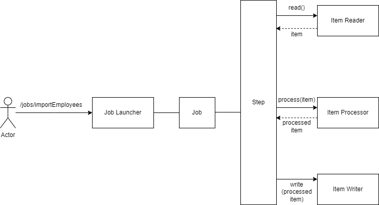

# etdbs
# spring batch example
This batch writes csv file to a table which is stored in MySql database.

Make a post request to trigger batch
````
http://localhost:8082/jobs/importEmployees
````

Components and their relation is drawn as below:
